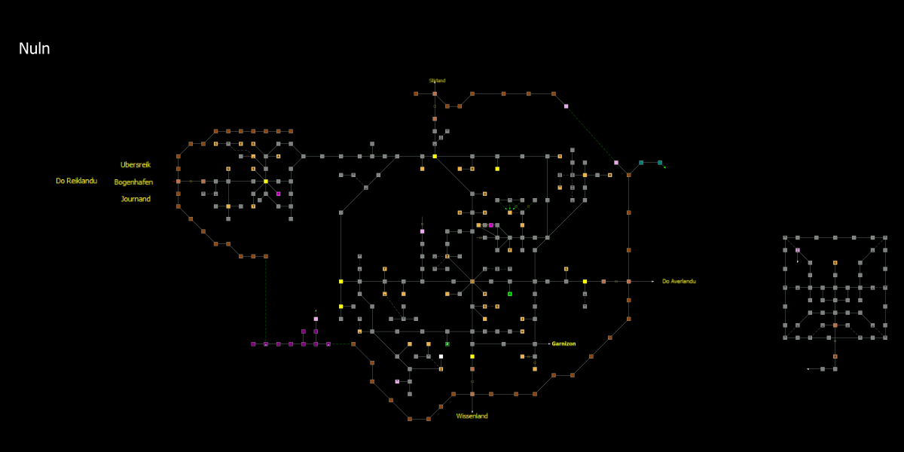

# mudlet-map-renderer

A rendering library for [Mudlet](https://www.mudlet.org/) map data. Takes Mudlet's JSON map format and renders interactive, zoomable maps using Konva, with SVG and PNG export support.



## Install

```bash
yarn add mudlet-map-renderer
```

## Quick start

```ts
import { MudletMapReader } from 'mudlet-map-binary-reader';
import { MapRenderer, MapReader, createSettings } from 'mudlet-map-renderer';

// Read a Mudlet binary map file and export renderer-compatible data
const map = MudletMapReader.read('map.dat');
const { mapData, colors } = MudletMapReader.export(map);

const mapReader = new MapReader(mapData, colors);

// Create an interactive renderer attached to a DOM element
const container = document.getElementById('map') as HTMLDivElement;
const renderer = new MapRenderer(mapReader, createSettings(), container);

// Display an area (area ID, z-level)
renderer.drawArea(42, 0);

// Show the player position (centers the viewport on the room)
renderer.setPosition(1234);
```

## Usage

### Settings

Create a settings object with `createSettings()` and customize before passing to the renderer:

```ts
import { createSettings } from 'mudlet-map-renderer';

const settings = createSettings();
settings.roomSize = 0.8;
settings.roomShape = 'circle';           // 'rectangle' | 'circle' | 'roundedRectangle'
settings.backgroundColor = '#1a1a2e';
settings.lineColor = 'rgb(200, 220, 255)';
settings.gridEnabled = true;
settings.emboss = true;
settings.areaName = true;

// Player position marker
settings.playerMarker.strokeColor = '#ff6600';
settings.playerMarker.fillColor = '#ff6600';
settings.playerMarker.fillAlpha = 0.3;
settings.playerMarker.matchRoomShape = true;

const renderer = new MapRenderer(mapReader, settings, container);
```

Settings are a shared mutable object. To change settings after the renderer is already running, modify the properties and call `refresh()`:

```ts
// Change appearance at runtime
renderer.settings.roomShape = 'circle';
renderer.settings.emboss = true;
renderer.refresh();

// Background color has its own update method (CSS-only, no scene rebuild)
renderer.settings.backgroundColor = '#1a1a2e';
renderer.updateBackground();
```

### Navigation

```ts
// Switch to a different area and z-level
renderer.drawArea(areaId, zIndex);

// Move player position (auto-switches area if needed)
renderer.setPosition(roomId);

// Move player without centering the viewport
renderer.setPosition(roomId, false);

// Update the marker without triggering area switch logic
renderer.updatePositionMarker(roomId);

// Center viewport on a room (with animation)
renderer.centerOn(roomId);

// Center instantly (no animation)
renderer.centerOn(roomId, true);

// Remove the position marker
renderer.clearPosition();
```

### Highlights and paths

```ts
// Highlight rooms with a color
renderer.renderHighlight(roomId, '#ff0000');
renderer.renderHighlight(otherRoomId, 'rgba(0, 255, 0, 0.5)');

// Remove a specific highlight
renderer.removeHighlight(roomId);

// Check if a room is highlighted
if (renderer.hasHighlight(roomId)) { /* ... */ }

// Clear all highlights
renderer.clearHighlights();

// Render a path through a list of room IDs
renderer.renderPath([101, 102, 103, 104], '#66E64D');

// Clear all paths
renderer.clearPaths();
```

### Viewport control

```ts
// Zoom
renderer.setZoom(1.5);
renderer.zoomToCenter(2.0);
console.log(renderer.getZoom());

// Fit the entire area in view
renderer.fitArea();

// Get current viewport bounds (in map coordinates)
const bounds = renderer.getViewportBounds();
// { minX, maxX, minY, maxY }

// Control resize behavior
renderer.centerOnResize = true;   // re-center on window resize
renderer.minZoom = 0.1;
```

### Events

```ts
renderer.on('roomclick', ({ roomId, position }) => {
  console.log(`Clicked room ${roomId} at (${position.x}, ${position.y})`);
});

renderer.on('roomcontextmenu', ({ roomId, position }) => {
  // Right-click or long-press on a room
});

renderer.on('areaexitclick', ({ targetRoomId, position }) => {
  // Clicked an area exit — navigate to the target room's area
  renderer.setPosition(targetRoomId);
});

renderer.on('mapclick', () => {
  // Clicked on empty space
});

renderer.on('zoom', ({ zoom }) => {
  console.log(`Zoom level: ${zoom}`);
});

renderer.on('pan', (bounds) => {
  // Viewport moved
});

// Remove a listener
const handler = ({ roomId }) => { /* ... */ };
renderer.on('roomclick', handler);
renderer.off('roomclick', handler);
```

### Culling

For large maps, spatial culling hides off-screen rooms for better performance:

```ts
// "indexed" (default) — bucket-based spatial index, best for large maps
// "basic" — simple bounds check per room
// "none" — render everything (useful for debugging)
renderer.setCullingMode('indexed');
```

### Styles

A `Style` is a target-agnostic visual transformer. One style drives the
interactive canvas *and* every exporter — set it once and it applies to SVG,
PNG, and anything else you export.

```ts
import {
  compose, identityStyle,
  Parchment, Blueprint, Neon, Sketchy, Isometric,
} from 'mudlet-map-renderer';

// Single style
renderer.setStyle(Parchment);

// Compose a chain (left → right = inner → outer)
renderer.setStyle(compose(
  Parchment,
  Sketchy({ jitter: 0.012, color: '#4a3728' }),
  Isometric({ rotation: 30, depth: 0.18 }),
));

// Clear the current style
renderer.setStyle(identityStyle);
// or
renderer.clearStyle();
```

Built-in styles:

| Style | Effect |
|---|---|
| `Parchment` | Warm sepia / aged-paper palette |
| `Blueprint` | White lines on deep blue |
| `Neon` | Glowing neon outlines on dark background |
| `Sketchy({ jitter, color })` | Hand-drawn pencil wobble |
| `Isometric({ rotation?, depth? })` | 2:1 iso projection with optional cubes |

Custom styles extend `BaseStyle<Inner>` and override only the draw calls they
transform — see the built-ins for examples.

### Export

Exporters are plug-ins: a new output format is a new `Exporter<T>` class,
not a new `MapRenderer` method.

```ts
import {
  SvgExporter, PngExporter, PngBlobExporter, CanvasExporter,
} from 'mudlet-map-renderer';

// SVG (string)
const svg         = renderer.export(new SvgExporter());
const svgCentered = renderer.export(new SvgExporter({ roomId: 1234, padding: 5 }));
const svgTyped    = renderer.export(new SvgExporter({
  overlays: {
    position: { roomId: 1234 },
    highlights: [{ roomId: 100, color: '#ff0000' }],
    paths: [{ locations: [101, 102, 103], color: '#00ff00' }],
  },
}));

// PNG data URL
const pngUrl = renderer.export(new PngExporter({ pixelRatio: 2 }));

// PNG as Blob
const blob = await renderer.export(new PngBlobExporter({ pixelRatio: 2 }));

// Headless PNG bytes at a specific size (portable — works in browser + Node)
const png = renderer.export(new PngBytesExporter({
  width: 1920,
  height: 1080,
  roomId: 1234,
  padding: 5,
}));
// fs.writeFileSync('out.png', png!);            // Node
// new Blob([png!], { type: 'image/png' });      // Browser

// Canvas handle (if you need to draw more on it, attach to DOM, etc.)
const canvas = renderer.export(new CanvasExporter({
  width: 1920,
  height: 1080,
}));
```

Style + export compose: the style currently applied with `setStyle` is passed
to every exporter, so the SVG, the PNG, and the on-screen canvas stay in sync.

Writing a new exporter — e.g. PDF — means shipping a class that implements
`Exporter<Uint8Array>`. No changes to `MapRenderer`.

### Headless rendering (no DOM)

For server-side or offscreen rendering, omit the container argument:

```ts
const renderer = new MapRenderer(mapReader, createSettings());

renderer.drawArea(42, 0);
renderer.state.positionRoomId = 1234;  // mark player position without auto-centering

const svg = renderer.export(new SvgExporter({ padding: 5 }));
const png = renderer.export(new PngBytesExporter({ width: 1920, height: 1080 }));
```

### Overlays

Two kinds, picked by what you need:

- **`SceneOverlay`** — target-agnostic, appears in every output (interactive
  canvas + every exporter). Use for static scene content (badges, annotations).
- **`LiveEffect`** — interactive canvas only, receives a Konva layer and
  viewport updates for animation. Skipped by exporters.

```ts
import type { SceneOverlay, LiveEffect } from 'mudlet-map-renderer';

// Scene overlay — uses target-agnostic draw primitives
class BadgeOverlay implements SceneOverlay {
  render(target, state, bounds) {
    const g = target.createGroup(0, 0);
    target.addCircle(g, { cx: 5, cy: 5, radius: 0.4, fill: '#ff0' });
    return g;
  }
}

renderer.addSceneOverlay('badge', new BadgeOverlay());
renderer.removeSceneOverlay('badge');

// Live effect — gets a Konva layer, interactive only
class Pulse implements LiveEffect {
  attach(layer) { /* add Konva shapes */ }
  updateViewport(bounds, scale) { /* react to pan/zoom */ }
  destroy() { /* cleanup */ }
}

renderer.addLiveEffect('pulse', new Pulse());
renderer.removeLiveEffect('pulse');
```

### Cleanup

Call `destroy()` when you're done with a renderer to release all resources — DOM event listeners, Konva stages, and internal subscriptions:

```ts
const renderer = new MapRenderer(mapReader, settings, container);

// ... use the renderer ...

// Tear down completely
renderer.destroy();
```

This is important in SPAs and frameworks like React where components mount and unmount. Without calling `destroy()`, event listeners on `window` and the container element will leak.

#### React example

```tsx
import { useEffect, useRef } from 'react';
import { MapRenderer, MapReader, createSettings } from 'mudlet-map-renderer';

function MudletMap({ mapData, envData, areaId, roomId }) {
  const containerRef = useRef<HTMLDivElement>(null);

  useEffect(() => {
    if (!containerRef.current) return;

    const mapReader = new MapReader(mapData, envData);
    const renderer = new MapRenderer(mapReader, createSettings(), containerRef.current);

    renderer.drawArea(areaId, 0);
    if (roomId) renderer.setPosition(roomId);

    return () => {
      renderer.destroy();
    };
  }, [mapData, envData, areaId, roomId]);

  return <div ref={containerRef} style={{ width: '100%', height: '100%' }} />;
}
```

## Pathfinding

```ts
import { MapReader, PathFinder, MapGraph, computePathData } from 'mudlet-map-renderer';

const mapReader = new MapReader(mapData, envData);
const pathFinder = new PathFinder(mapReader);

// Find shortest path between two rooms (Dijkstra or A*)
const roomIds = pathFinder.findPath(startRoomId, endRoomId, 'astar');

if (roomIds) {
  // Render the path on the map
  renderer.renderPath(roomIds, '#66E64D');

  // Or compute detailed path geometry for custom rendering
  const pathData = computePathData(mapReader, renderer.settings, roomIds, '#66E64D');
}
```

## Exploration mode

Show only rooms the player has visited (fog of war):

```ts
const mapReader = new MapReader(mapData, envData);

// Enable exploration with a set of visited room IDs
const visitedRooms = mapReader.decorateWithExploration(new Set([100, 101, 102, 200]));

// Add newly visited rooms as the player explores
visitedRooms.add(103);

// Areas automatically filter to only show visited rooms
const renderer = new MapRenderer(mapReader, createSettings(), container);
renderer.drawArea(areaId, 0);

// Disable exploration mode (show all rooms again)
mapReader.clearExplorationDecoration();
renderer.refresh();
```

## Map data format

The renderer expects data produced by [mudlet-map-binary-reader](https://github.com/Delwing/node-mudlet-map-binary-reader), which reads Mudlet's binary `map.dat` format and exports renderer-compatible structures:

```ts
import { MudletMapReader } from 'mudlet-map-binary-reader';

const map = MudletMapReader.read('map.dat');
const { mapData, colors } = MudletMapReader.export(map);
// mapData: MapData.Map (Area[])
// colors:  MapData.Env[]
```

`MapReader` accepts these two values directly:

```ts
const mapReader = new MapReader(mapData, colors);
```

The binary reader can also write exported data to files for static use:

```ts
MudletMapReader.export(map, 'output');  // writes .js files
MudletMapReader.exportJson(map, 'map.json');
```

## API reference

### `MapRenderer`

| Method | Description |
|--------|-------------|
| `drawArea(id, zIndex)` | Display an area at a z-level |
| `setPosition(roomId, center?)` | Set player position (auto-switches area) |
| `updatePositionMarker(roomId)` | Update marker without area switch |
| `clearPosition()` | Remove position marker |
| `centerOn(roomId, instant?)` | Center viewport on a room |
| `renderHighlight(roomId, color)` | Highlight a room |
| `removeHighlight(roomId)` | Remove a highlight |
| `clearHighlights()` | Clear all highlights |
| `renderPath(roomIds, color?)` | Draw a path |
| `clearPaths()` | Clear all paths |
| `setZoom(zoom)` | Set zoom level |
| `zoomToCenter(zoom)` | Zoom keeping center fixed |
| `fitArea()` | Fit the full area in view |
| `setStyle(style)` | Apply a visual style (interactive + exporters) |
| `clearStyle()` | Remove the current style |
| `export(exporter)` | Run an `Exporter<T>` and return its output |
| `addSceneOverlay(id, overlay)` | Add a target-agnostic overlay |
| `removeSceneOverlay(id)` | Remove a scene overlay |
| `addLiveEffect(id, effect)` | Add an interactive-only animated effect |
| `removeLiveEffect(id)` | Remove a live effect |
| `refresh()` | Force a full re-render |
| `on(event, handler)` | Subscribe to an event |
| `off(event, handler)` | Unsubscribe from an event |
| `setCullingMode(mode)` | Set culling strategy |
| `destroy()` | Release all resources |

### Exporters

| Exporter | Output |
|---|---|
| `SvgExporter({ roomId?, padding?, overlays? })` | `string` — SVG document |
| `PngExporter({ pixelRatio? })` | `string` — PNG data URL (current viewport) |
| `PngBlobExporter({ pixelRatio? })` | `Promise<Blob>` — PNG Blob (browser only) |
| `PngBytesExporter({ width, height, roomId?, padding?, overlays?, mimeType?, quality? })` | `Uint8Array` — headless PNG/JPEG bytes; portable (browser + Node) |
| `CanvasExporter({ width, height, roomId?, padding?, overlays? })` | `ExportCanvas` — canvas handle; reframes to fit |

### Styles

| Style | Constructor / Usage |
|---|---|
| `Parchment` | `setStyle(Parchment)` |
| `Blueprint` | `setStyle(Blueprint)` |
| `Neon` | `setStyle(Neon)` |
| `Sketchy(opts)` | `setStyle(Sketchy({ jitter, color }))` |
| `Isometric(opts)` | `setStyle(Isometric({ rotation?, depth? }))` |
| `compose(...)` | Chain multiple styles into one |
| `identityStyle` | Pass-through; equivalent to `clearStyle()` |

### `PathFinder`

| Method | Description |
|--------|-------------|
| `findPath(from, to, algorithm?)` | Find shortest path (`'dijkstra'` or `'astar'`) |

### `MapReader`

| Method | Description |
|--------|-------------|
| `getArea(areaId)` | Get an area by ID |
| `getAreas()` | Get all areas |
| `getRoom(roomId)` | Get a room by ID |
| `getRooms()` | Get all rooms |
| `decorateWithExploration(visited?)` | Enable fog of war |
| `clearExplorationDecoration()` | Disable fog of war |

## License

MIT
