# Architecture

This document describes the high-level architecture of **mudlet-map-renderer**, a TypeScript library for rendering Mudlet MUD maps as interactive, zoomable 2D canvases or static exports (SVG/PNG).

---

## System Overview

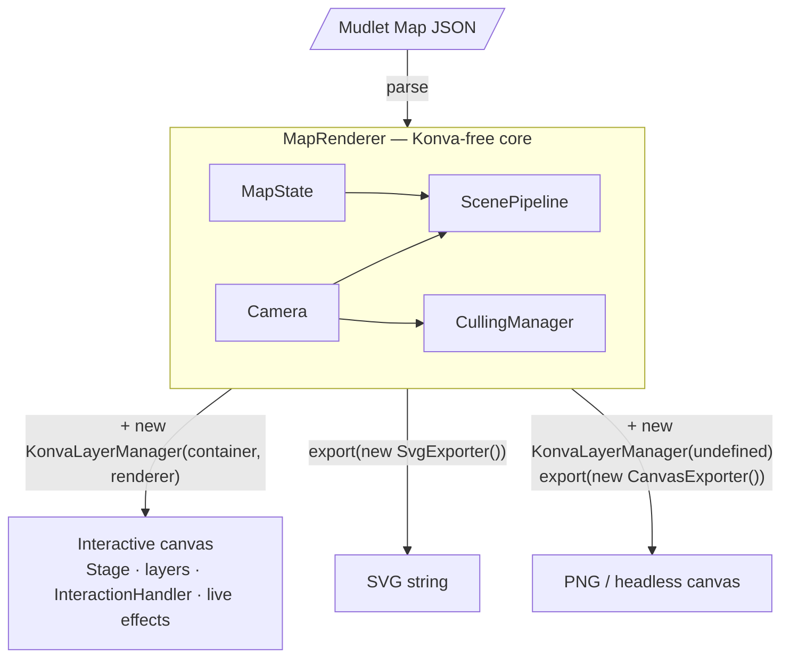

---

## Key Design Principles

1. **`MapRenderer` is Konva-free.** It owns state, camera, culling, pipeline, and scene overlays. No Konva import.
2. **`KonvaLayerManager` is injectable.** Create it separately and pass `renderer` to wire it up. SVG-only use requires no `KonvaLayerManager` at all.
3. **One `ScenePipeline` code path.** Layer nodes are passed at `buildScene()` time — Konva nodes for interactive, SVG nodes for export. Same code, different output target.
4. **`Camera` drives everything.** Subscribe to all viewport changes via `camera.addChangeListener()` — fires for user gestures, animated pans, and programmatic moves alike.

---

## Layered Architecture

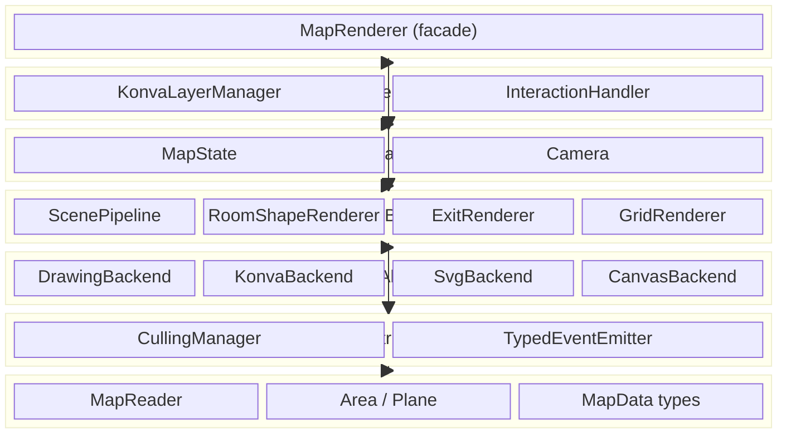

---

## Data Flow

### Setting Up — Interactive Mode

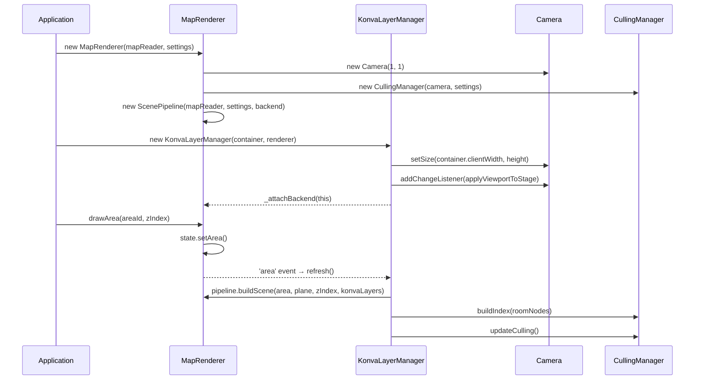

### Setting Up — SVG-Only (No Konva)

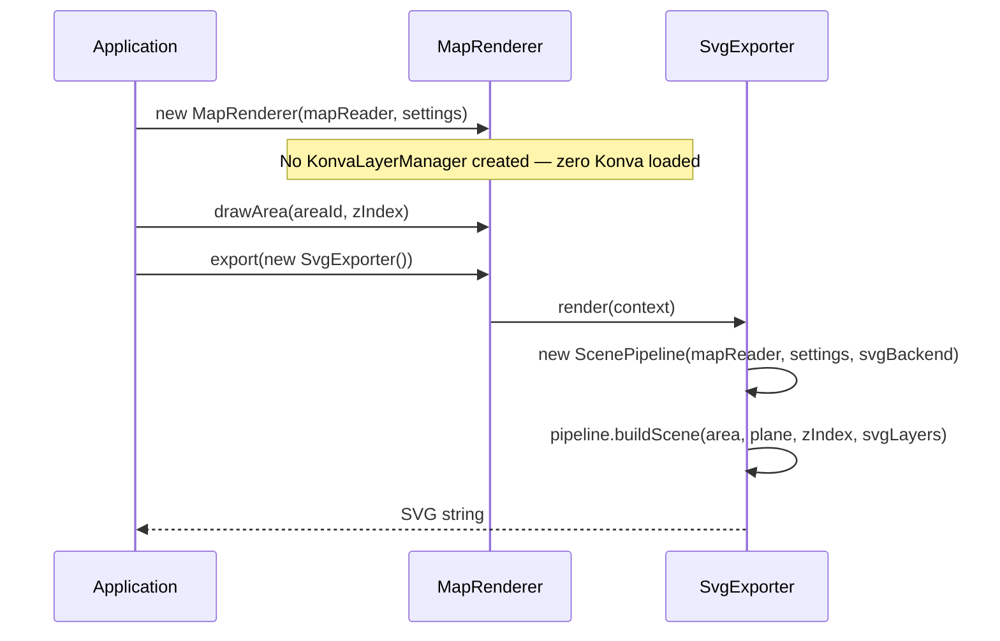

### User Interaction Flow

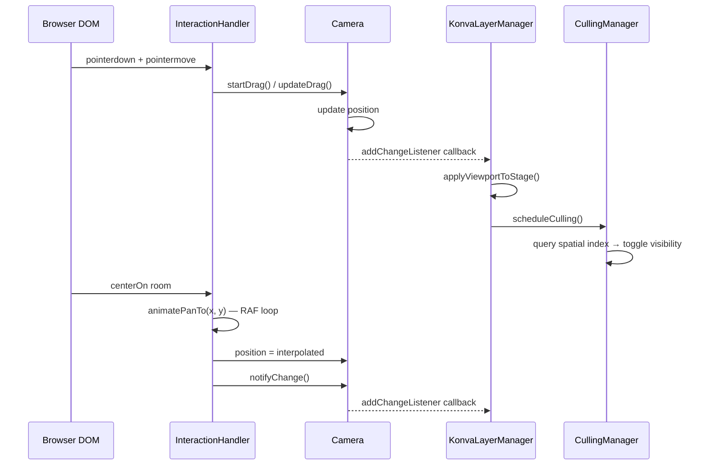

---

## Core Components

### MapRenderer — Public Facade

`MapRenderer` is Konva-free. It owns state, camera, culling, the shared pipeline, style, and scene overlays. All rendering is forwarded to the injected `KonvaLayerManager` via the `RenderingBackend` interface.

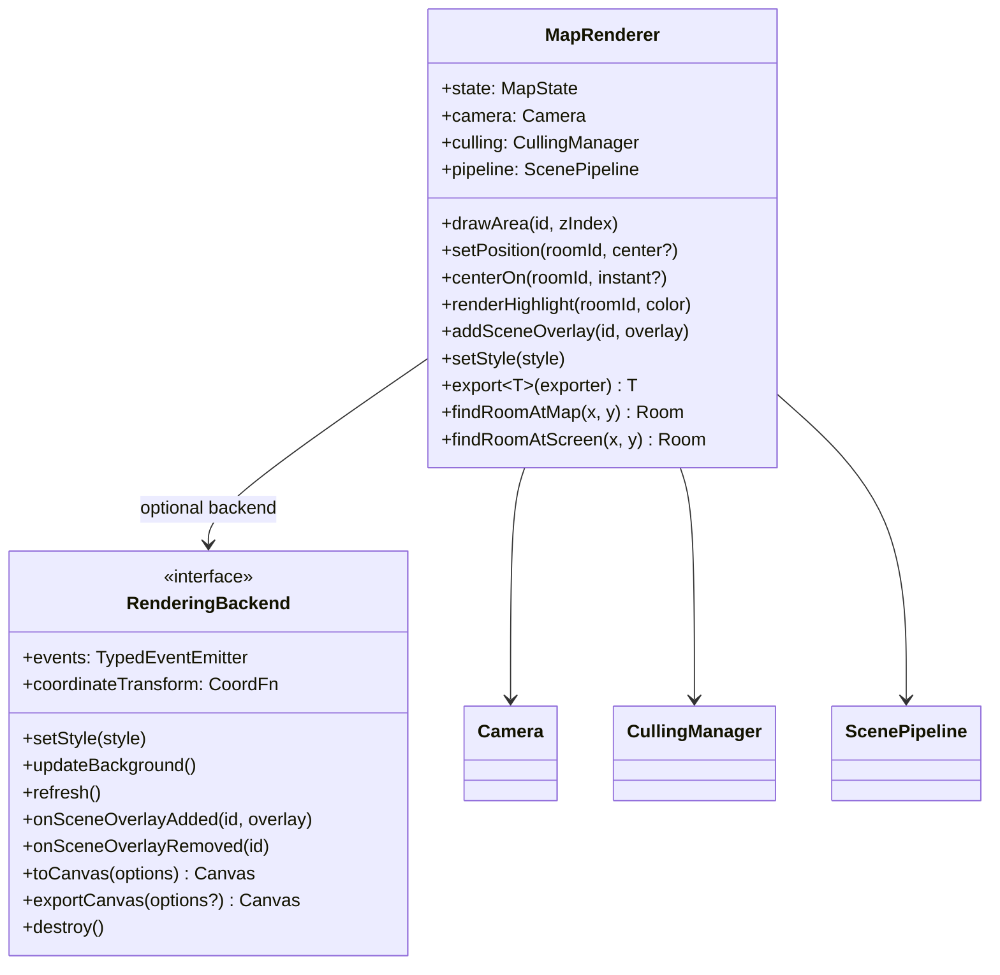

### Camera — Viewport State

`Camera` owns all transform state. Use `addChangeListener` to subscribe to every viewport change regardless of cause.

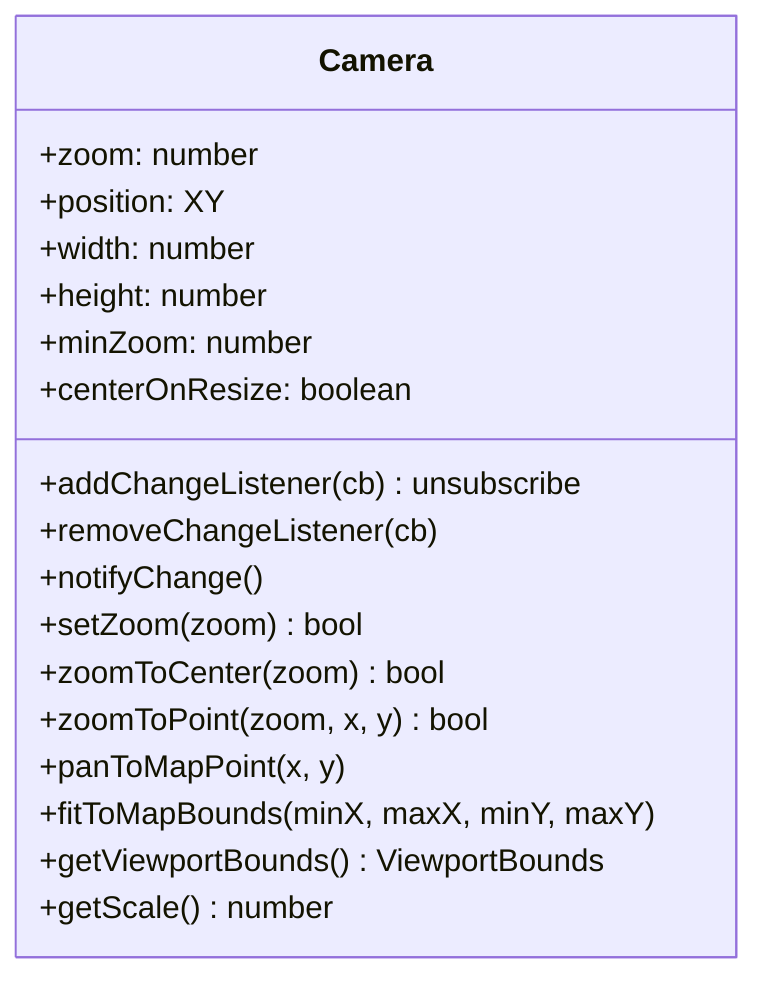

> **`pan` event vs `addChangeListener`:** `renderer.on('pan', cb)` fires only on user gesture pans (mouse drag, wheel, touch). For full viewport tracking — including animated `centerOn` and programmatic pans — use `renderer.camera.addChangeListener(cb)`.

### KonvaLayerManager — Injectable Konva Backend

Owns the physical canvas infrastructure and all Konva-specific rendering. Wires into `MapRenderer` at construction. Can be absent entirely for SVG-only usage.

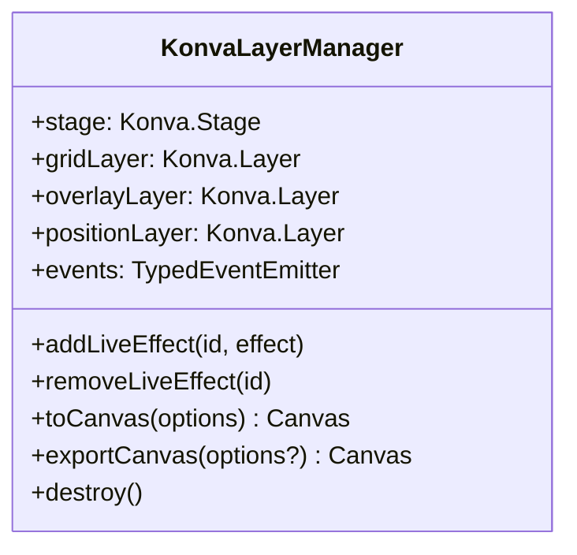

### ScenePipeline — Unified Scene Builder

`ScenePipeline` is fully backend-agnostic. Layer nodes are passed at `buildScene()` time — Konva recording nodes for interactive rendering, SVG layer nodes for export. The same code path runs for both.

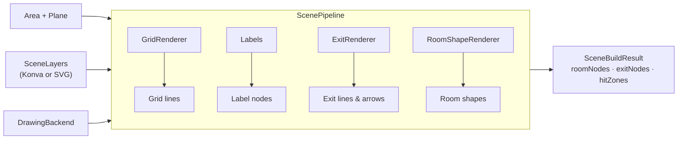

### DrawingBackend — Rendering Abstraction

All visual output flows through `DrawingBackend`. Decorator backends wrap an inner backend to transform drawing calls (isometric projection, sketchy wobble, parchment colours).

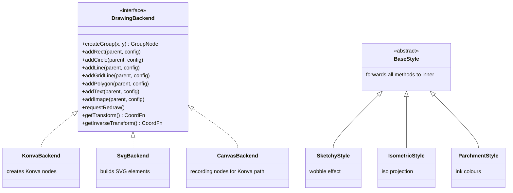

> `addGridLine` is intentionally separate from `addLine` so decorator backends can exempt grid lines from effects like the sketchy wobble.

### MapState — Pure State Container

`MapState` holds all mutable rendering state with zero rendering logic. State changes are broadcast via typed events.

**Events emitted:**

| Event | Trigger | Payload |
|-------|---------|---------|
| `area` | Area or z-level changes | `{ area, zIndex }` |
| `position` | Player location changes | `{ roomId, center, areaChanged }` |
| `center` | Camera focus requested | `{ roomId, instant }` |
| `highlight` | Highlight added/removed | `{ roomId, color? }` |
| `path` | Path overlay changes | — |
| `clear` | All overlays cleared | — |

---

## Rendering Paths

### Interactive (Konva)

```
Application
  → new MapRenderer(mapReader, settings)
  → new KonvaLayerManager(container, renderer)
  → state event → KonvaLayerManager.refresh()
  → pipeline.buildScene(area, plane, zIndex, konvaLayers, viewportBounds)
  → CanvasBackend (or styled decorator) → RecordingLayerNode → Konva.Layer
  → KonvaLayerManager.culling.updateCulling() → toggle visibility
```

### SVG Export

```
renderer.export(new SvgExporter())
  → new ScenePipeline(mapReader, settings, svgBackend)
  → pipeline.buildScene(area, plane, zIndex, svgLayers, exportBounds)
  → SvgBackend → SvgLayerNode.toSvg() → SVG string
```

### Headless PNG Export

```
new KonvaLayerManager(undefined, renderer)   ← no DOM container
renderer.export(new CanvasExporter({width, height}))
  → KonvaLayerManager.toCanvas(options)
  → stage.toCanvas() → composite with background → Uint8Array
```

---

## Layer Structure (Konva)

```mermaid
flowchart TB
    subgraph Stage["Konva.Stage"]
        direction TB
        L1["Layer 1: Grid<br/><i>background grid lines</i>"]
        L2["Layer 2: Scene (shared)<br/><i>exits + rooms + labels — one Konva.Layer</i>"]
        L3["Layer 3: Position<br/><i>player marker, current room highlight</i>"]
        L4["Layer 4: Overlay<br/><i>highlights, paths, scene overlays, live effects</i>"]
        L5["Layer 5: Top Labels<br/><i>noScaling labels</i>"]
    end

    L1 ~~~ L2 ~~~ L3 ~~~ L4 ~~~ L5

    style L1 fill:#1a1a2e
    style L2 fill:#16213e
    style L3 fill:#0f3460
    style L4 fill:#533483
    style L5 fill:#e94560
```

> Link exits and rooms share one physical `Konva.Layer` to stay under Konva's recommended layer count. Z-order is preserved by insertion order inside a `RecordingLayerNode`.

---

## Culling Pipeline

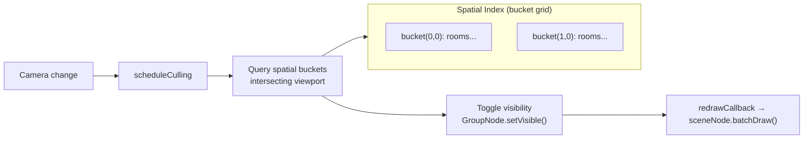

`CullingManager` has no Konva dependency — it reads scale, position, and viewport size directly from `Camera`. Redraw notification is injected via `setRedrawCallback()`.

---

## Overlays

### SceneOverlay — appears everywhere

`SceneOverlay` renders through `DrawingBackend` and appears in all output paths (interactive canvas, SVG, PNG). Registered on `MapRenderer`.

```ts
renderer.addSceneOverlay('ambient', new AmbientLightOverlay({ color: '#ffcc44' }));
```

### LiveEffect — interactive only

`LiveEffect` receives the Konva overlay layer and a scoped `requestRedraw` callback. Skipped by exporters by design. Registered on `KonvaLayerManager`.

```ts
konva.addLiveEffect('fog', new FogOfWarOverlay());
```

---

## Extensibility

### Adding a New Output Format

1. Implement `DrawingBackend` — shape primitives
2. Create `LayerNode` implementations for your target
3. Call `renderer.pipeline.buildScene(area, plane, zIndex, yourLayers, backend)` directly

### Adding a Visual Style

Extend `BaseStyle<Inner>` — all methods forward to `inner` by default. Override only what you need:

```ts
class MyStyle<T extends DrawingBackend> extends BaseStyle<T> {
    addRect(parent, config) {
        this.inner.addRect(parent, { ...config, fill: transform(config.fill) });
    }
}

renderer.setStyle(backend => new MyStyle(backend));
```

### Viewport Change Notifications

```ts
// All changes — user gestures, animation, programmatic
const unsub = renderer.camera.addChangeListener(() => minimap.update());
// cleanup
unsub();

// User gesture pans only
renderer.on('pan', (bounds) => statusBar.update(bounds));
```

---

## Key Source Files

| File | Purpose |
|------|---------|
| `src/rendering/MapRenderer.ts` | Konva-free public facade — state, camera, culling, pipeline, overlays |
| `src/rendering/KonvaLayerManager.ts` | Injectable Konva backend — stage, layers, interaction, live effects |
| `src/Camera.ts` | Zoom/pan/bounds state; multi-listener change notification |
| `src/MapState.ts` | Pure state container with typed events |
| `src/ScenePipeline.ts` | Backend-agnostic scene builder; accepts `SceneLayers` at buildScene time |
| `src/GridRenderer.ts` | Grid rendering with caching; layer injected at render time |
| `src/backend/DrawingBackend.ts` | Shape abstraction interface + `BaseStyle` decorator base |
| `src/backend/KonvaBackend.ts` | Konva node factory (stateless) |
| `src/backend/SvgBackend.ts` | SVG element builder |
| `src/backend/CanvasBackend.ts` | Recording backend for Konva path; materialises into Konva nodes |
| `src/style/` | Visual style decorators: Sketchy, Parchment, Blueprint, Neon, Isometric |
| `src/CullingManager.ts` | Spatial indexing and viewport culling; no Konva dependency |
| `src/InteractionHandler.ts` | DOM event handling — mouse, touch, wheel, animated pans |
| `src/export/SvgExporter.ts` | SVG export via shared `ScenePipeline` with SVG layer nodes |
| `src/export/CanvasExporter.ts` | Headless canvas export |
| `src/export/PngExporter.ts` | PNG data URL / blob export |
| `src/overlay/SceneOverlay.ts` | Backend-agnostic overlay interface (all output paths) |
| `src/overlay/LiveEffect.ts` | Konva-specific animated effect interface |
| `src/scene/OverlayStyle.ts` | Pure-data overlay computation (highlights, position marker, paths) |
| `src/scene/OverlayRenderer.ts` | Renders overlays through `DrawingBackend` |
| `src/reader/MapReader.ts` | Mudlet JSON parser and data indexer |
| `src/RoomShapeRenderer.ts` | Room shape and symbol rendering |
| `src/ExitRenderer.ts` | Exit geometry computation |
| `src/types/Settings.ts` | Settings, event types, `createSettings()` |
| `src/types/MapData.ts` | Mudlet map data type definitions |
