# Architecture

This document describes the high-level architecture of **mudlet-map-renderer**, a TypeScript library for rendering Mudlet MUD maps as interactive, zoomable 2D canvases or static exports (SVG/PNG).

---

## System Overview

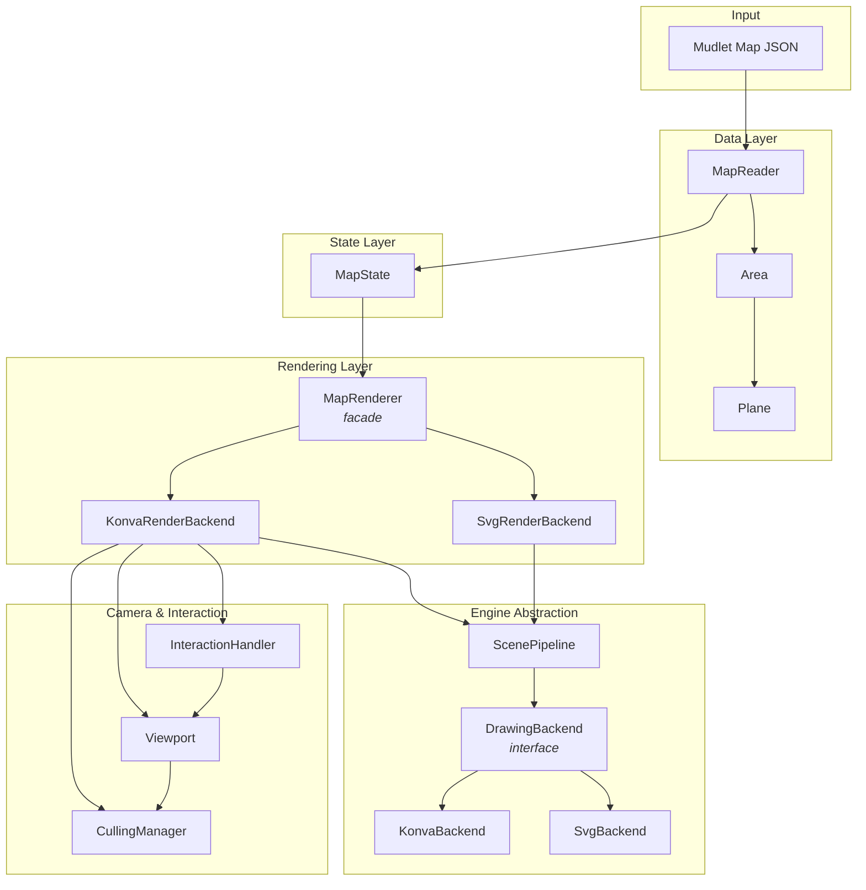

---

## Layered Architecture

The codebase follows a strict layered design. Each layer depends only on layers below it.

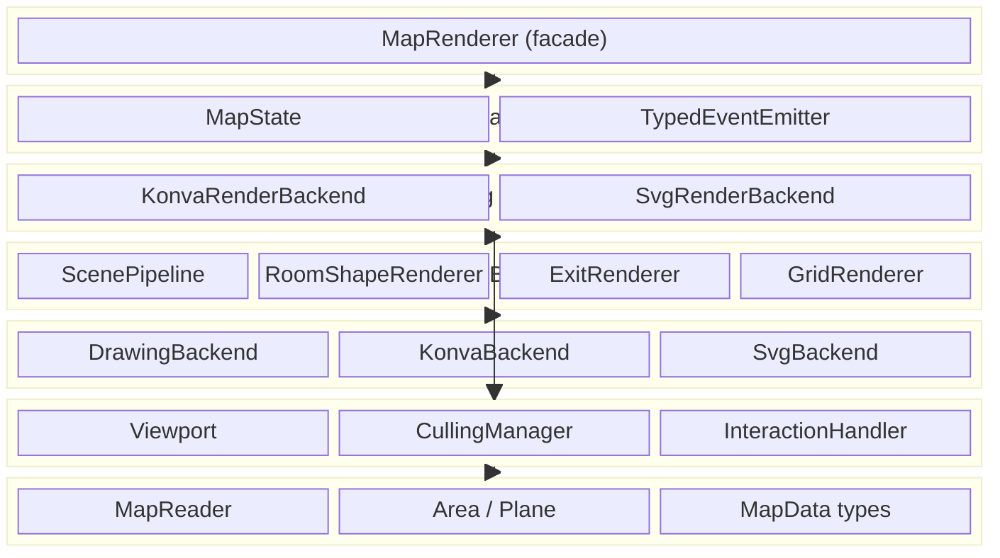

---

## Data Flow

### Loading and Rendering a Map

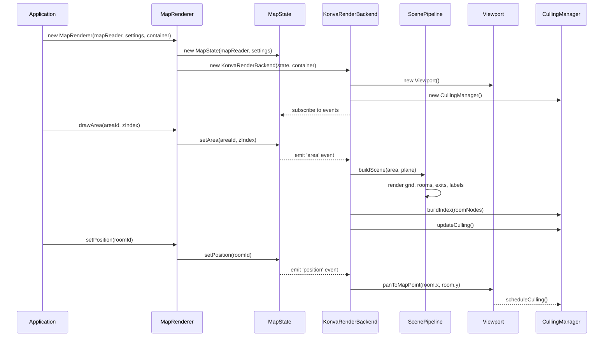

### User Interaction Flow

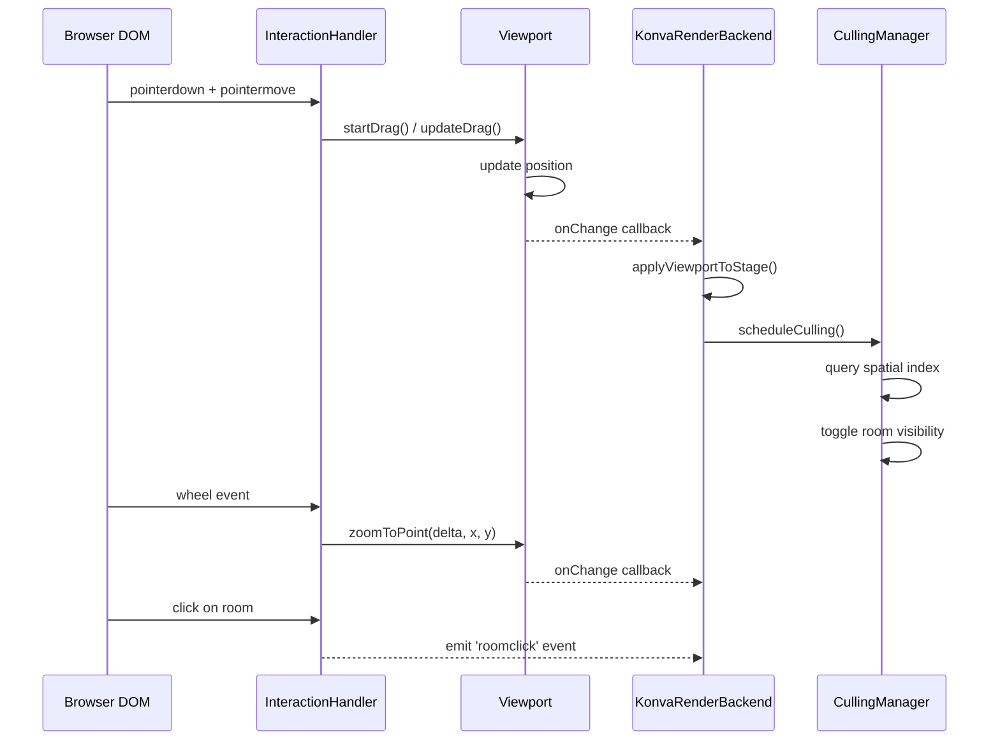

---

## Core Components

### MapState — Pure State Container

`MapState` holds all mutable state with zero rendering logic. State changes are broadcast via typed events, keeping backends decoupled.

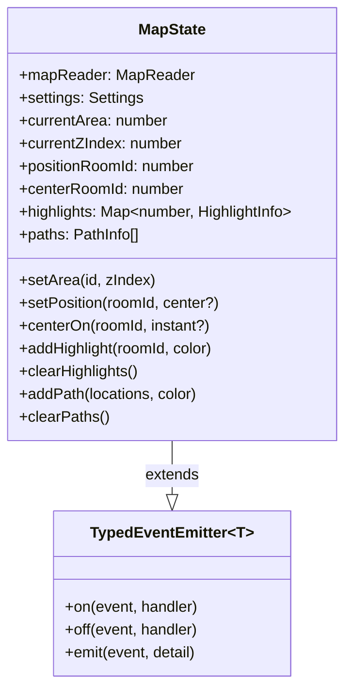

**Events emitted:**

| Event | Trigger | Payload |
|-------|---------|---------|
| `area` | Area or z-level changes | `{ area, zIndex }` |
| `position` | Player location changes | `{ roomId, center, areaChanged }` |
| `center` | Camera focus changes | `{ roomId, instant }` |
| `highlight` | Highlight added/removed | `{ roomId, color? }` |
| `path` | Path overlay changes | — |
| `clear` | All overlays cleared | — |

### DrawingBackend — Rendering Abstraction

All visual output flows through `DrawingBackend`, eliminating code duplication across rendering targets. Both scene building (rooms, exits, grid) and overlay rendering (highlights, position marker, paths) use this interface.

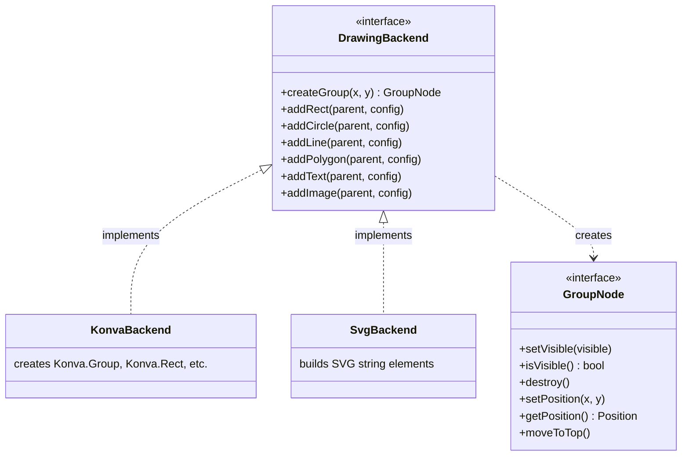

### InteractiveBackend — Backend Contract

`MapRenderer` delegates all rendering to an `InteractiveBackend`, allowing alternative engines (PixiJS, Paper.js, etc.).

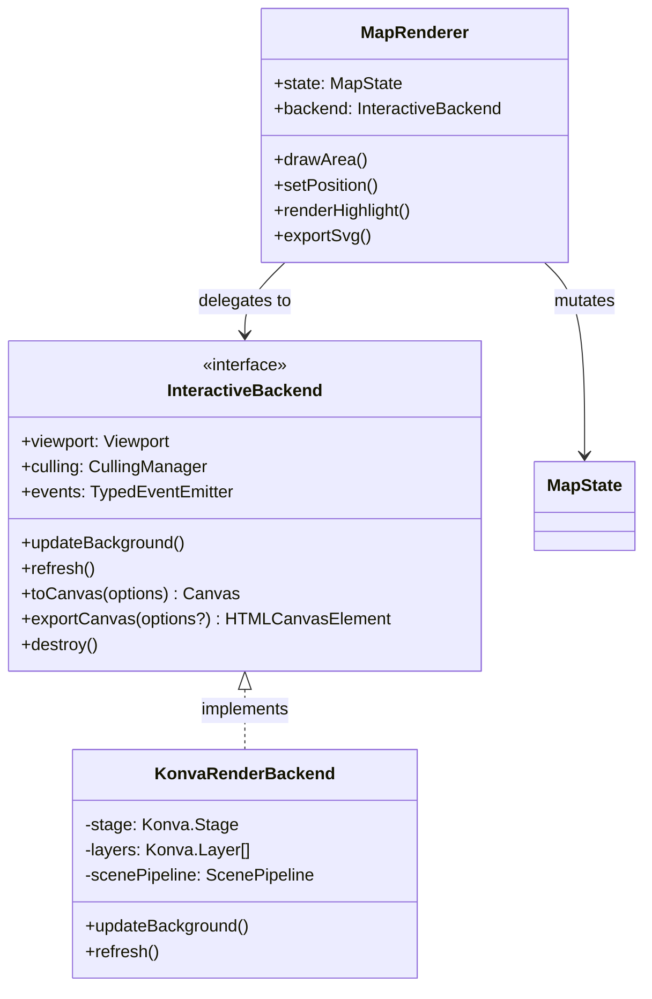

---

## Rendering Pipeline

### Scene Building

`ScenePipeline` is the backend-agnostic scene builder. It receives a `DrawingBackend` and builds the complete visual scene from map data.

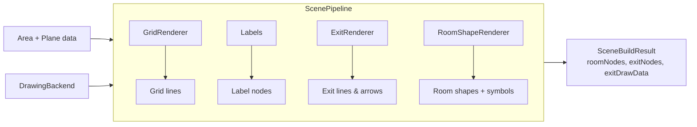

### Overlay Rendering

Overlays (highlights, position marker, path trails) are computed as pure data by `scene/OverlayStyle.ts` and rendered through `DrawingBackend` by `scene/OverlayRenderer.ts`. Both `KonvaRenderBackend` and `SvgRenderBackend` use this shared path.

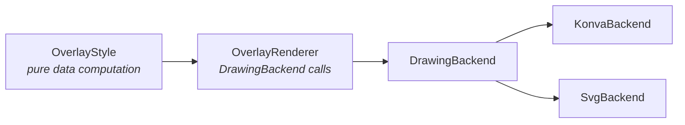

### Layer Structure (Konva)

The Konva backend organizes rendering into five layers, drawn bottom-to-top:

```mermaid
flowchart TB
    subgraph Stage["Konva.Stage"]
        direction TB
        L1["Layer 1: Grid<br/><i>background grid lines</i>"]
        L2["Layer 2: Links<br/><i>exit lines between rooms</i>"]
        L3["Layer 3: Rooms<br/><i>room shapes, symbols, labels</i>"]
        L4["Layer 4: Position<br/><i>player marker, current room</i>"]
        L5["Layer 5: Overlay<br/><i>highlights, paths</i>"]
    end

    L1 ~~~ L2 ~~~ L3 ~~~ L4 ~~~ L5

    style L1 fill:#1a1a2e
    style L2 fill:#16213e
    style L3 fill:#0f3460
    style L4 fill:#533483
    style L5 fill:#e94560
```

### SVG Export

`SvgRenderBackend` produces SVG output through the same `DrawingBackend` interface as the interactive Konva path. Scene content goes through `ScenePipeline` with `SvgBackend`, and overlays go through the shared `OverlayRenderer` with the same `SvgBackend` instance.

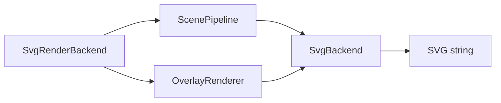

### Culling Pipeline

Spatial bucketing prevents rendering thousands of off-screen rooms.

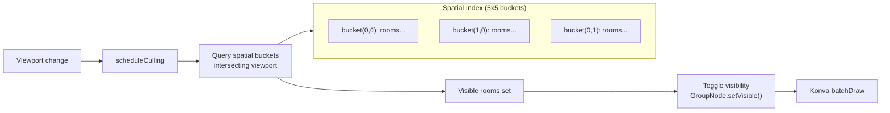

---

## Data Model

### Map Data Hierarchy

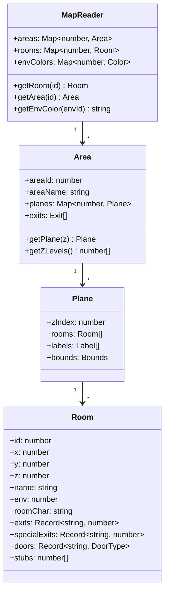

### Exit Types

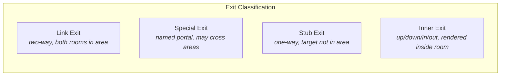

---

## Room Rendering Modes

The library supports multiple visual modes controlled by `Settings`:

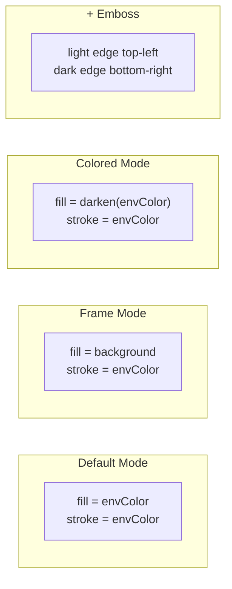

Room shapes: `circle` | `rectangle` | `roundedRectangle`

---

## Extensibility

### Adding a New Rendering Backend

To render to a new target (WebGL, Canvas2D, etc.):

1. **Implement `DrawingBackend`** — 7 methods for shape primitives
2. **Pass to `ScenePipeline`** — the pipeline drives your implementation
3. **Optionally implement `InteractiveBackend`** — for full interactive support

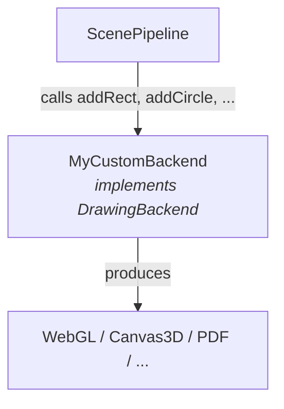

### Injecting a Custom Interactive Backend

```typescript
const renderer = new MapRenderer(mapReader, settings, container,
    (state) => new MyCustomRenderBackend(state, container));
```

---

## Key Source Files

| File | Purpose |
|------|---------|
| `src/rendering/MapRenderer.ts` | Public facade — all public API lives here |
| `src/MapState.ts` | Pure state container with typed events |
| `src/rendering/KonvaRenderBackend.ts` | Interactive Konva.js rendering backend |
| `src/rendering/SvgRenderBackend.ts` | SVG export backend (uses DrawingBackend) |
| `src/backend/DrawingBackend.ts` | Shape abstraction interface |
| `src/backend/KonvaBackend.ts` | Konva implementation of DrawingBackend |
| `src/backend/SvgBackend.ts` | SVG implementation of DrawingBackend |
| `src/ScenePipeline.ts` | Backend-agnostic scene builder |
| `src/scene/OverlayStyle.ts` | Pure-data overlay computation (highlights, marker, paths) |
| `src/scene/OverlayRenderer.ts` | Renders overlays through DrawingBackend |
| `src/Viewport.ts` | Zoom/pan/animation (engine-agnostic) |
| `src/CullingManager.ts` | Spatial indexing and visibility culling |
| `src/InteractionHandler.ts` | DOM event handling (mouse, touch, keyboard) |
| `src/reader/MapReader.ts` | Mudlet JSON parser and data indexer |
| `src/RoomShapeRenderer.ts` | Room shape and symbol rendering |
| `src/ExitRenderer.ts` | Exit geometry computation |
| `src/types/Settings.ts` | Settings type, event types, and `createSettings()` factory |
| `src/types/MapData.ts` | Mudlet map data type definitions |
| `src/utils/color.ts` | Color utilities (darken, lightness, hex-to-rgba) |
| `src/SvgTypes.ts` | SVG export option and overlay types |
| `src/Renderer.ts` | Deprecated backward-compat `Renderer` wrapper class |
| `src/HeadlessRenderer.ts` | Deprecated backward-compat `HeadlessRenderer` wrapper class |
