# Architecture

This document describes the high-level architecture of **mudlet-map-renderer**, a TypeScript library for rendering Mudlet MUD maps as interactive, zoomable canvases or static exports (SVG / PNG / Canvas).

The pipeline is built around three engine-neutral intermediate representations:

1. **Shape** — world-space scene geometry (rooms, exits, labels) emitted by `ScenePipeline`.
2. **Style** — pure functions that transform Shapes (Parchment, Blueprint, Neon, Sketchy, Isometric).
3. **DrawCommand** — camera-baked, render-space drawing primitives consumed by concrete renderers (Konva, Canvas2D, SVG).

There is no `DrawingBackend` abstraction anymore — `ScenePipeline` is backend-free, and each renderer / exporter consumes Shapes (or their compiled DrawCommands) directly.

---

## System Overview

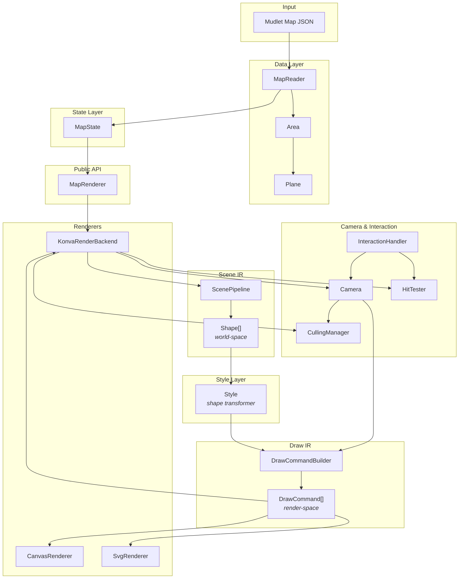

---

## Layered Architecture

The codebase follows a strict layered design. Each layer depends only on layers below it.

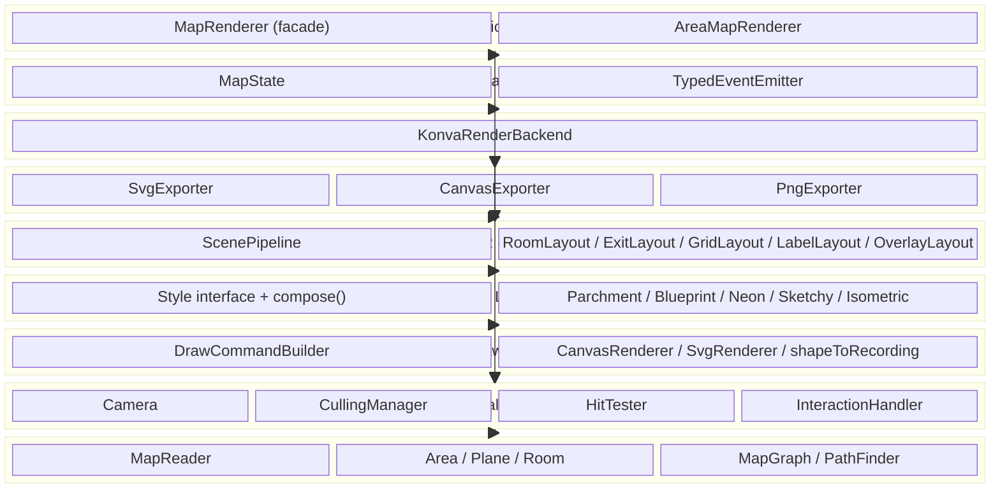

---

## Data Flow

### Loading and Rendering a Map

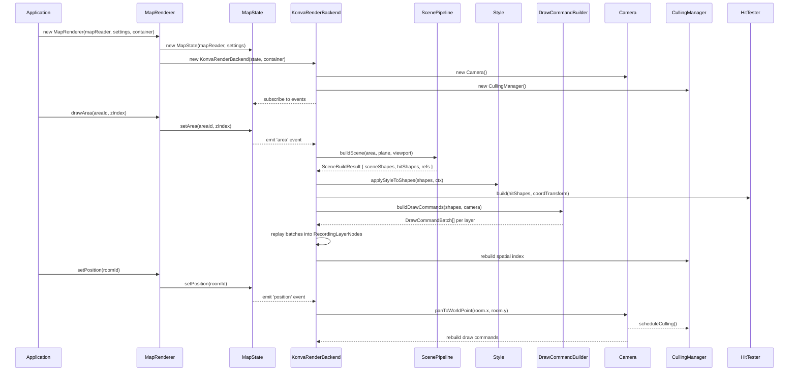

### User Interaction Flow

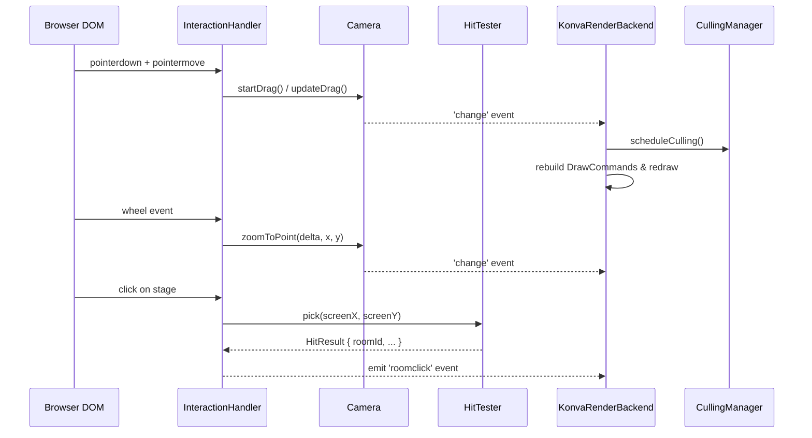

---

## Core Components

### MapState — Pure State Container

`MapState` holds all mutable state with zero rendering logic. State changes are broadcast via typed events; renderers subscribe.

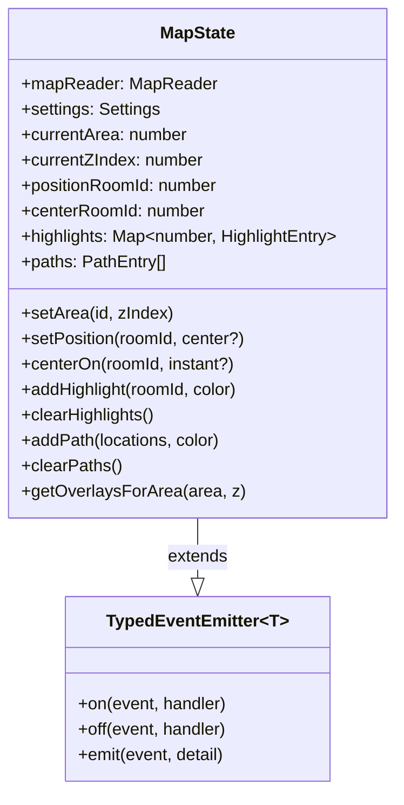

**Events emitted:**

| Event | Trigger | Payload |
|-------|---------|---------|
| `area` | Area or z-level changes | `{ area, zIndex }` |
| `position` | Player location changes | `{ roomId, center, areaChanged }` |
| `center` | Camera focus changes | `{ roomId, instant }` |
| `highlight` | Highlight added/removed | `{ roomId, color? }` |
| `path` | Path overlay changes | — |
| `clear` | All overlays cleared | — |

### Shape — Engine-Neutral Scene IR

Defined in `src/scene/Shape.ts`. World-space geometry emitted by `ScenePipeline`, with no engine knowledge.

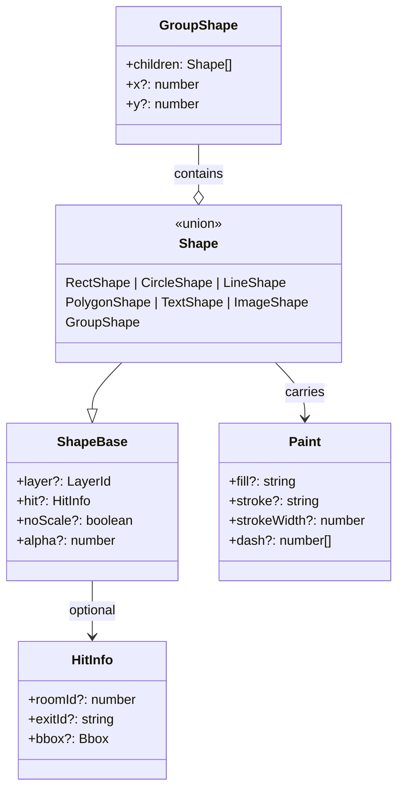

Layers: `grid` | `link` | `room` | `position` | `overlay` | `top`.

### Style — Shape Transformer

A `Style` is a pure function that maps one Shape to zero or more output Shapes. Styles compose left-to-right and run **before** culling, hit-testing, and DrawCommand compilation.

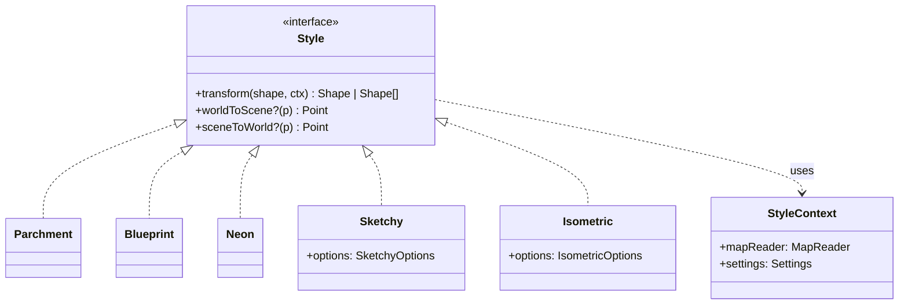

`compose(a, b, c)` returns a Style whose `transform` is `c ∘ b ∘ a`. `applyStyleToShapes(shapes, style, ctx)` walks a shape tree and reassembles the styled output.

`Isometric` additionally provides `worldToScene` / `sceneToWorld` — a 2.5D projection consumed by `CullingManager` and `HitTester` so spatial queries stay correct after geometric warping.

### DrawCommand — Render-Space Draw IR

Defined in `src/draw/DrawCommand.ts`. Coordinates are **already in render space** (camera transform applied) and paint is fully baked. `DrawCommandBuilder.buildDrawCommands(shapes, camera)` is the only producer.

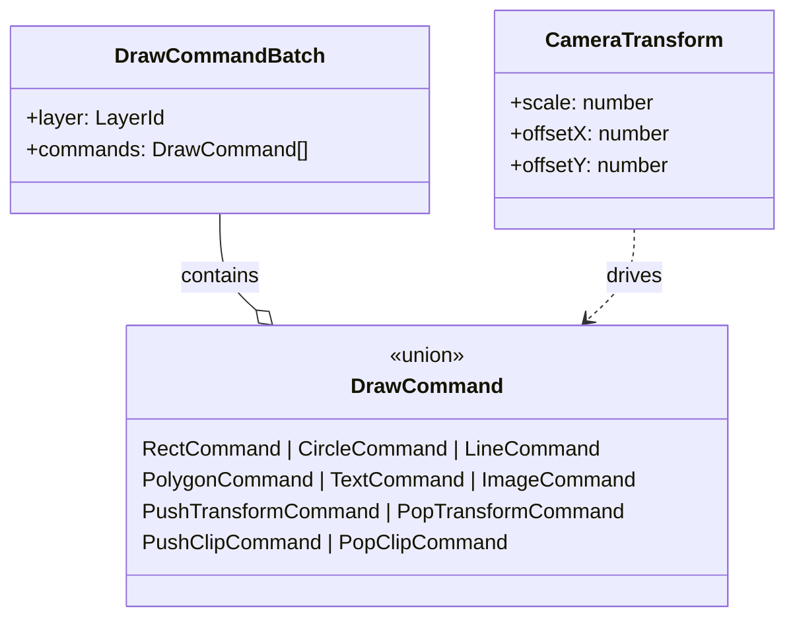

`noScale` Shapes (e.g. text that should stay screen-sized) are wrapped in `PushTransform` / `PopTransform` pairs that cancel the camera scale.

### MapRenderer — Public Facade

`MapRenderer` is a thin facade: it owns `MapState` and an `InteractiveBackend` (default `KonvaRenderBackend`), and exposes the entire public API.

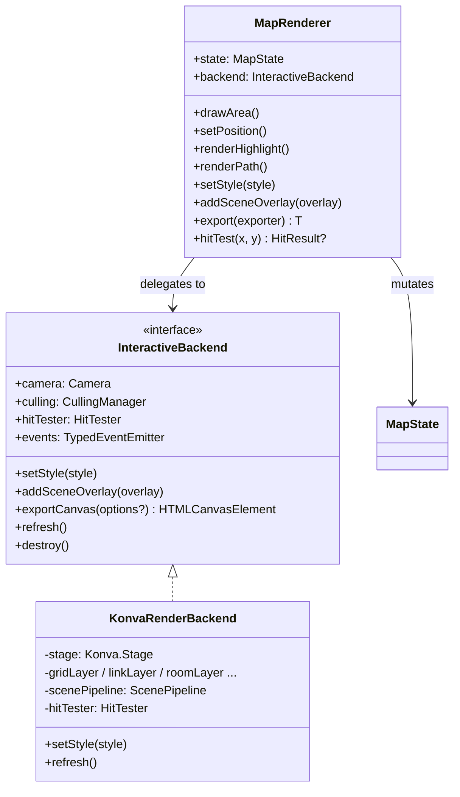

---

## Rendering Pipeline

### Scene Building

`ScenePipeline.buildScene(area, plane, viewport?)` is engine-neutral. It produces a `SceneBuildResult` whose primary outputs are `sceneShapes` (per-layer Shape arrays) and `hitShapes` (annotated for `HitTester`).

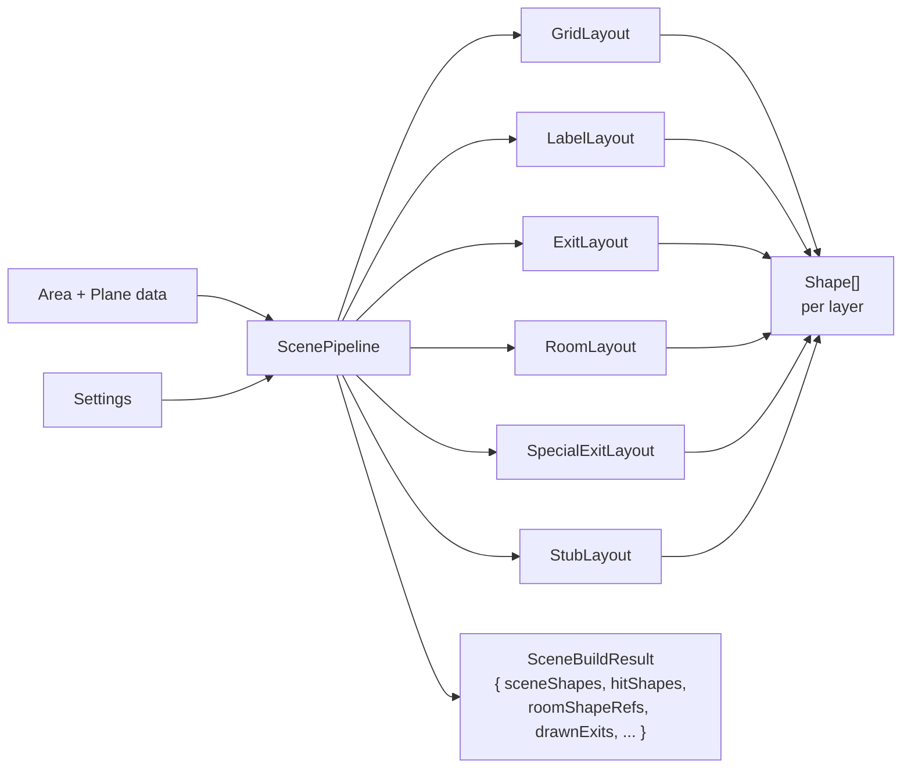

The `*Layout` modules in `src/scene/elements/` build the actual geometry. The `*Style` modules in `src/style/` (`RoomStyle`, `GridStyle`, `OverlayStyle`, `InnerExitStyle`, `SpecialExitStyle`, `StubStyle`, `AmbientLightStyle`) are pure-data helpers that compute colors, geometry parameters, and overlay shapes — they are **not** `Style` interface implementations, just data computations shared across layouts.

### Style → DrawCommand → Renderer

Once Shapes are built, the rest of the pipeline is uniform across interactive and export paths:

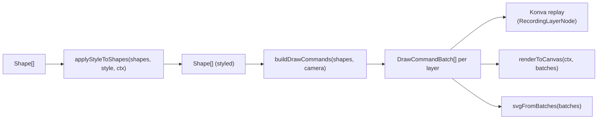

- `src/render/CanvasRenderer.ts` — replays DrawCommands onto a `CanvasRenderingContext2D`. Used by `CanvasExporter` and `PngExporter`.
- `src/render/SvgRenderer.ts` — emits an SVG string from DrawCommandBatches. Used by `SvgExporter`.
- `src/render/RecordingLayer.ts` — Konva-side replay infrastructure: `RecordingLayerNode` stores `DrawEntry`s (one per scene group) and materializes them into a single Konva.Shape with a `sceneFunc`, giving cheap visibility toggling for culling without recreating Konva nodes.
- `src/render/shapeToRecording.ts` — converts a single Shape to recording draw commands (used by Konva when adding/updating individual scene groups).

### Layer Structure (Konva)

`KonvaRenderBackend` exposes six logical layers but uses **five** physical `Konva.Layer`s — `linkLayer` and `roomLayer` share one underlying layer to stay under Konva's recommended layer count. Drawn bottom-to-top:

```mermaid
flowchart TB
    subgraph Stage["Konva.Stage"]
        direction TB
        L1["Layer 1: Grid<br/><i>background grid lines</i>"]
        L2["Layer 2: Scene (link + room)<br/><i>two-way exits, room shapes, symbols,<br/>inner exits, stubs — one shared Konva.Layer</i>"]
        L3["Layer 3: Position<br/><i>player marker, current room ring</i>"]
        L4["Layer 4: Overlay<br/><i>highlights, paths, SceneOverlays, live effects</i>"]
        L5["Layer 5: Top Label<br/><i>area name, area-exit labels (always on top)</i>"]
    end

    L1 ~~~ L2 ~~~ L3 ~~~ L4 ~~~ L5

    style L1 fill:#1a1a2e
    style L2 fill:#0f3460
    style L3 fill:#533483
    style L4 fill:#e94560
    style L5 fill:#3a2d5c
```

### Export Pipeline

Exporters implement a tiny `Exporter<T>` interface and run the same Shape → Style → DrawCommand pipeline as the interactive backend, but with their own renderer at the tail.

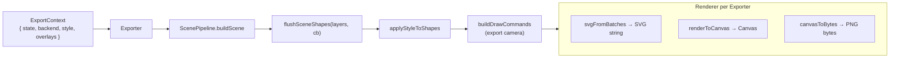

- `src/export/Exporter.ts` — `Exporter<T>` interface and `ExportContext` definition.
- `src/export/flushSceneShapes.ts` — single source of truth for the canonical layer order and how built-in / custom `SceneOverlay` shapes are merged in.
- `src/export/sceneBounds.ts` — derives the export region from area bounds, viewport, or room-centred bounds.
- `src/export/SvgExporter.ts` — drives the pipeline and returns an SVG string.
- `src/export/CanvasExporter.ts` — produces an `ExportCanvas` (also exposes `PngBytesExporter`).
- `src/export/PngExporter.ts` — wraps `CanvasExporter` and returns a PNG data URL (`PngBlobExporter` returns a `Blob`).
- `src/export/canvasToBytes.ts` — browser- and Node-compatible canvas → PNG byte serialisation.

### Culling Pipeline

`CullingManager` is engine-neutral spatial bucketing keyed off `Camera.getViewportBounds()`. When the camera moves, the manager queries its index, computes which entries (rooms, exits) are in view, and invokes the visibility callbacks the backend supplied at registration time.

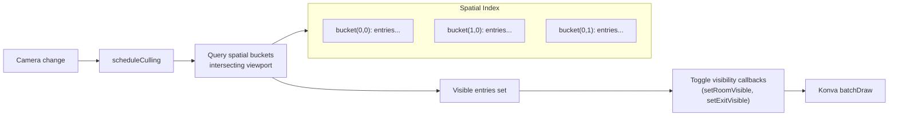

For non-trivial style projections (e.g. `Isometric`), the backend supplies a `CoordinateTransform` so culling and hit-testing operate in rendered space.

---

## Data Model

### Map Data Hierarchy

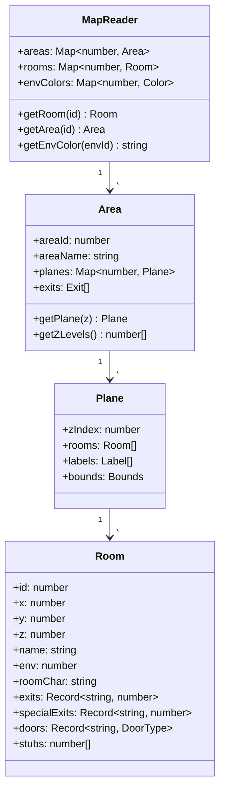

`src/MapGraph.ts` builds a graph of rooms + edges from the `MapReader`; `src/PathFinder.ts` runs A* over it; `src/PathData.ts` turns a path result into overlay geometry consumed by `OverlayLayout`.

### Exit Types

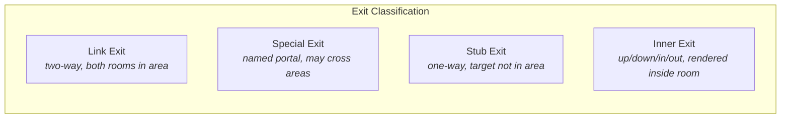

---

## Overlay System

`SceneOverlay` is the unified extension point for anything that is **not** part of the map's static scene — highlights, the player marker, path trails, ambient lighting, custom plug-ins.

```ts
interface SceneOverlay {
    attach?(ctx: SceneOverlayContext): void;
    detach?(): void;
    render(state: MapState, bounds: ViewportBounds): Shape | Shape[] | void;
}
```

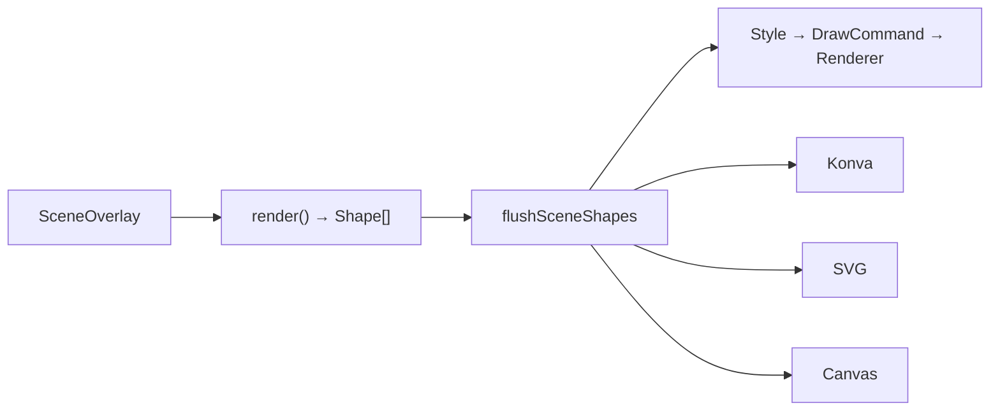

- Built-in overlays for highlights, position, and paths are merged in by `flushSceneShapes` so they appear in interactive output **and** every exporter without each overlay needing renderer-specific code.
- `src/overlay/AmbientLightOverlay.ts` — optional ambient lighting (vignette / shadows).
- `src/overlay/LiveEffect.ts` — Konva-only animated effects (rain, snow, pulses); attached to `KonvaRenderBackend` directly, not exported.
- `attach()` / `detach()` let an overlay subscribe to `MapState` and viewport events and call `ctx.invalidate()` to force a re-render. Exporters skip these hooks and call `render()` once.

---

## Camera, Hit-Testing & Interaction

| Concern | Module | Notes |
|---|---|---|
| Zoom / pan / animation | `src/camera/Camera.ts` | Pure math — no Konva or DOM. Emits `change` events; falls back to `setTimeout` outside the browser. Replaces the legacy `Viewport`. |
| Spatial visibility | `src/CullingManager.ts` | Engine-neutral. Accepts an optional `CoordinateTransform` so projected styles (Isometric) cull correctly. |
| Point → room lookup | `src/hit/HitTester.ts` | Built from the `hitShapes` returned by `ScenePipeline`; spatial index over annotated bboxes. Used by interaction *and* by `MapRenderer.hitTest()`. |
| DOM events | `src/InteractionHandler.ts` | Routes mouse / touch / wheel / resize to the camera and hit tester. No Konva dependency. |

---

## Extensibility

### Adding a New Style

A Style only needs to implement `transform(shape, ctx)`. It runs before culling, hit-testing, and command compilation, so it works with every renderer and exporter.

```typescript
import type { Style, Shape } from 'mudlet-map-renderer';

const RedTint: Style = {
    transform(shape: Shape) {
        if ('fill' in shape && shape.fill) {
            return { ...shape, fill: '#ff5555' };
        }
        return shape;
    },
};

renderer.setStyle(RedTint);
```

Compose with shipped styles via `compose(Parchment, RedTint)`.

### Adding a New Exporter

Implement `Exporter<T>` and drive the standard pipeline:

```typescript
import {
    type Exporter, type ExportContext,
    buildDrawCommands, applyStyleToShapes,
} from 'mudlet-map-renderer';

class MyExporter implements Exporter<MyOutput> {
    render(ctx: ExportContext): MyOutput {
        const scene = ctx.backend.buildSceneFor(ctx.state); // or call ScenePipeline directly
        const styled = applyStyleToShapes(scene.shapes, ctx.style, ctx);
        const batches = buildDrawCommands(styled, exportCamera);
        return myEngineReplay(batches);
    }
}
```

### Adding a New Interactive Backend

Implement `InteractiveBackend` (camera + culling + hit-testing + scene rebuild on `MapState` events) and inject it via `MapRenderer`'s factory:

```typescript
const renderer = new MapRenderer(mapReader, settings, container,
    (state, container) => new MyCustomBackend(state, container));
```

Backends are free to consume Shapes directly (like Konva does, via `RecordingLayerNode`) or compile them to `DrawCommand`s with `buildDrawCommands` and replay through `renderToCanvas` / `svgFromBatches` / a custom replayer.

---

## AreaMapRenderer

`src/AreaMapRenderer.ts` is a separate top-level renderer for the **meta-map** (areas as nodes, inter-area exits as edges, force-directed layout). It owns its own Konva stage and does **not** share the main `ScenePipeline`. It is exported alongside `MapRenderer` for consumers that need both views.

---

## Key Source Files

| File | Purpose |
|------|---------|
| `src/index.ts` | Public package exports |
| `src/rendering/MapRenderer.ts` | Public facade — owns MapState and the interactive backend |
| `src/MapState.ts` | Pure state container with typed events |
| `src/rendering/KonvaRenderBackend.ts` | Konva.js interactive backend; consumes Shapes via RecordingLayerNode |
| `src/AreaMapRenderer.ts` | Standalone meta-map (areas + inter-area edges) renderer |
| `src/ScenePipeline.ts` | Backend-free scene builder; produces Shape[] + hit shapes |
| `src/scene/Shape.ts` | Engine-neutral scene IR (Shape union, Paint, HitInfo, LayerId) |
| `src/scene/elements/RoomLayout.ts` | Room body, border, emboss, symbol shapes |
| `src/scene/elements/ExitLayout.ts` | Two-way link exits and inner (up/down/in/out) exits |
| `src/scene/elements/GridLayout.ts` | Background grid shapes |
| `src/scene/elements/LabelLayout.ts` | Room labels, area name, area-exit labels |
| `src/scene/elements/SpecialExitLayout.ts` | Special-exit polylines and arrows |
| `src/scene/elements/StubLayout.ts` | One-way stub indicators |
| `src/scene/elements/OverlayLayout.ts` | Highlights, position marker, path trails as Shapes |
| `src/style/Style.ts` | Style interface + `compose()` |
| `src/style/applyStyle.ts` | Walks shape trees applying a Style |
| `src/style/index.ts` | Re-exports Parchment / Blueprint / Neon / Sketchy / Isometric |
| `src/style/shape/*Style.ts` | Concrete Style implementations |
| `src/style/shape/paintMap.ts` | Palette lookup tables for shape-based styles |
| `src/style/shape/wobble.ts` | Deterministic jitter for Sketchy |
| `src/style/RoomStyle.ts` | `computeRoomColors()` — single source of truth for room paint |
| `src/style/GridStyle.ts` | Grid spacing, color, alpha config |
| `src/style/OverlayStyle.ts` | Pure-data overlay geometry (highlights, marker, paths) |
| `src/style/AmbientLightStyle.ts` | Ambient-light overlay parameters |
| `src/style/InnerExitStyle.ts` | Inner-exit triangle geometry |
| `src/style/SpecialExitStyle.ts` | Special-exit polyline geometry |
| `src/style/StubStyle.ts` | Stub line geometry |
| `src/draw/DrawCommand.ts` | Render-space draw IR (DrawCommand union, batches) |
| `src/draw/DrawCommandBuilder.ts` | `buildDrawCommands(shapes, camera)` — Shape → DrawCommand |
| `src/render/CanvasRenderer.ts` | Replays DrawCommandBatches onto Canvas2D |
| `src/render/SvgRenderer.ts` | Emits SVG string from DrawCommandBatches |
| `src/render/RecordingLayer.ts` | Konva-side replay (RecordingLayerNode, DrawEntry) |
| `src/render/shapeToRecording.ts` | Single-shape → recording draw commands |
| `src/export/Exporter.ts` | Exporter interface + ExportContext |
| `src/export/SvgExporter.ts` | SVG string export |
| `src/export/CanvasExporter.ts` | ExportCanvas + PngBytesExporter |
| `src/export/PngExporter.ts` | PNG data URL / Blob exporters |
| `src/export/flushSceneShapes.ts` | Canonical layer order + overlay merging for exports |
| `src/export/sceneBounds.ts` | Export region computation |
| `src/export/canvasToBytes.ts` | Browser + Node canvas serialisation |
| `src/camera/Camera.ts` | Engine-agnostic zoom / pan / animation |
| `src/CullingManager.ts` | Spatial bucketing, viewport culling |
| `src/hit/HitTester.ts` | Spatial point → Shape lookup |
| `src/InteractionHandler.ts` | DOM event routing (mouse, touch, keyboard) |
| `src/overlay/SceneOverlay.ts` | Unified overlay extension point |
| `src/overlay/AmbientLightOverlay.ts` | Ambient lighting overlay |
| `src/overlay/LiveEffect.ts` | Konva-only animated effects |
| `src/reader/MapReader.ts` | Mudlet JSON parser and data indexer |
| `src/reader/ExplorationArea.ts` | Fog-of-war area decorator |
| `src/MapGraph.ts` | Room graph construction |
| `src/PathFinder.ts` | A* pathfinding over MapGraph |
| `src/PathData.ts` | Path result → overlay geometry |
| `src/ExitRenderer.ts` | Exit geometry computation (used by ExitLayout) |
| `src/coord/CoordFn.ts` | Coordinate-transform helpers (used by Isometric) |
| `src/types/Settings.ts` | Settings type, event types, `createSettings()` |
| `src/types/MapData.ts` | Mudlet map data type definitions |
| `src/utils/color.ts` | Color utilities (darken, lightness, hex-to-rgba) |
| `src/SvgTypes.ts` | SVG export option and overlay types |
